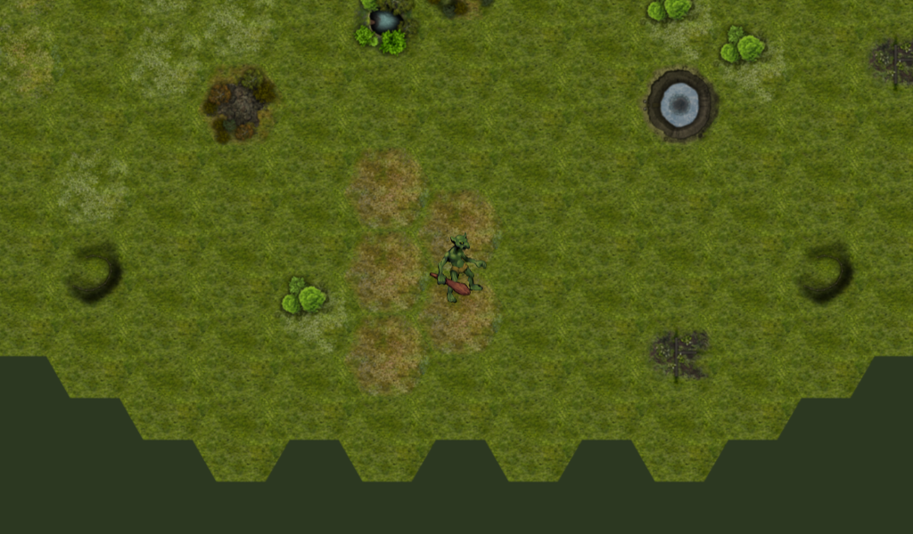

# Hexagonal Game

Very simple demo showing a hexagonal TileMap and TileSet.

Language: Java

Renderer: Compatibility

Check out this demo on the asset library: https://godotengine.org/asset-library/asset/2717

## Screenshots

