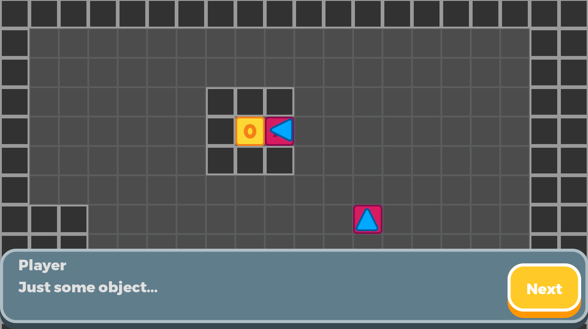
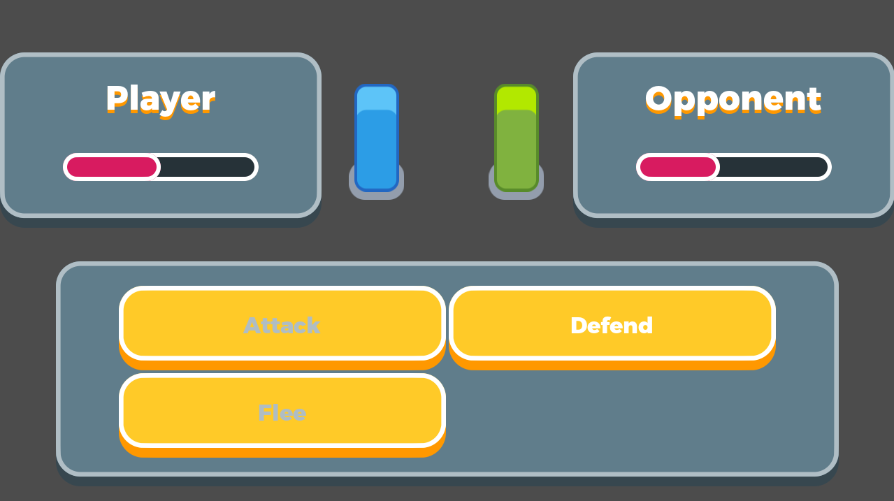

# Role Playing Game

This shows a method of creating grid-based movement with Godot
and Java. It also includes a simple JRPG-style dialogue and
battle system on top of it.

Language: Java

Renderer: Compatibility

Check out this demo on the asset library: https://godotengine.org/asset-library/asset/2729

## Screenshots

