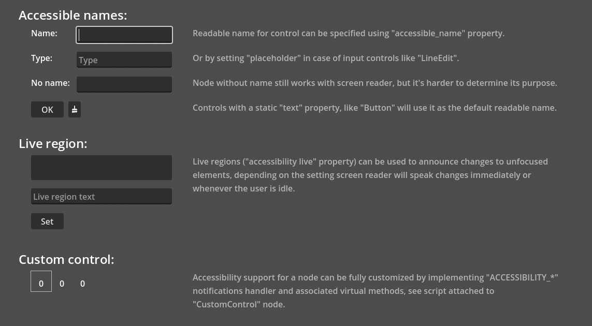

# UI Accessibility

This is a demo of UI accessibility in Godot.

Demo shows basic UI accessibility features and making custom nodes accessible.

Language: Java

Java custom controls can override `_notification(int)`, `_accessibilityUpdate()`, and `_accessibilityInvalidate()` to update screen-reader metadata when Godot accessibility notifications arrive.

Renderer: Compatibility

## Screenshots

