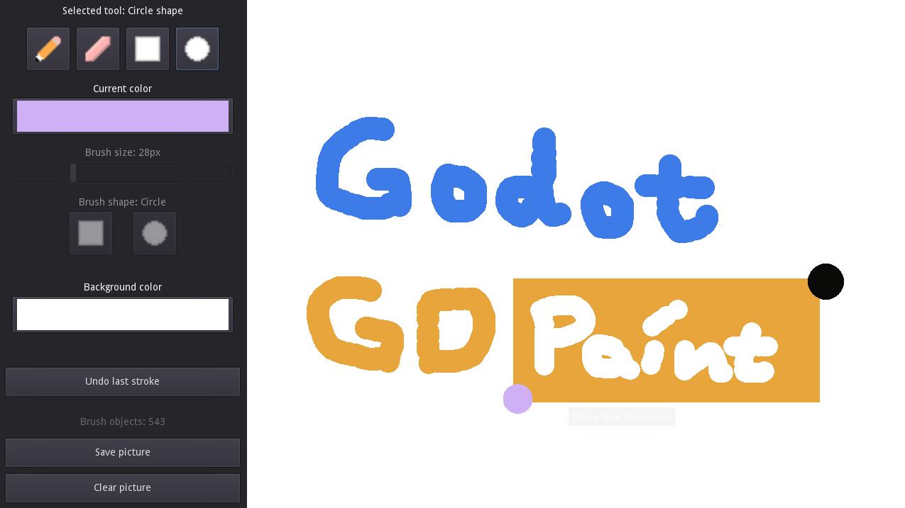

# GD Paint

GD Paint is a simple image editor made using Godot and Java.
It supports different types of "brushes": a basic pen/pencil
and eraser, as well as a rectangle and a circle brush.

Language: Java

Renderer: Compatibility

Check out this demo on the asset library: https://godotengine.org/asset-library/asset/2768

## Screenshots

