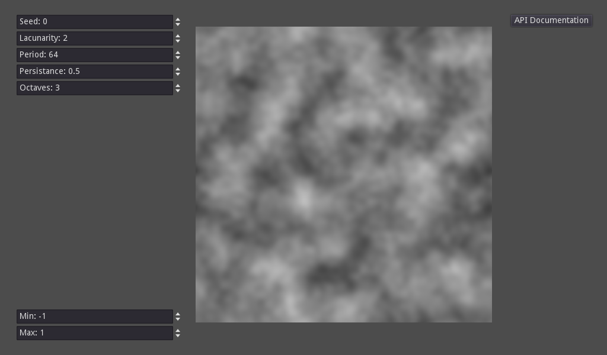

# Noise Viewer

This is a sample project which allows the user to tweak different parameters of
a FastNoiseLite texture.

Language: Java

Renderer: Compatibility

Check out this demo on the asset library: https://godotengine.org/asset-library/asset/2788

## Screenshots

