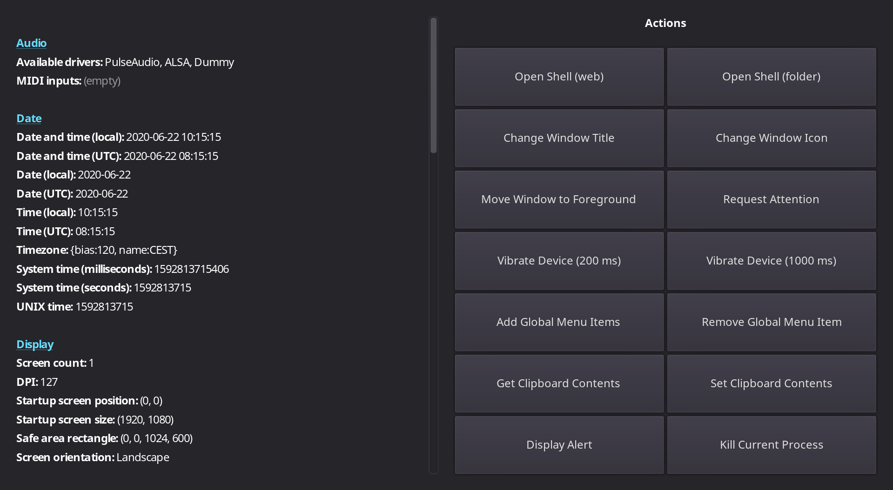

# Operating System Testing

This demo showcases various OS-specific features in Godot.
It can be used to test Godot while porting it to a
new platform or to check for regressions.

In a nutshell, this demo shows how you can get information from the
operating system, or interact with the operating system.

Language: Java

Renderer: Compatibility

Check out this demo on the asset library: https://godotengine.org/asset-library/asset/2789

## How does it work?

The [`OS`](https://docs.godotengine.org/en/latest/classes/class_os.html)
class provides an abstraction layer over the platform-dependent code.
OS wraps the most common functionality to communicate with the host
operating system, such as the clipboard, video driver, date and time,
timers, environment variables, execution of binaries, command line, etc.

The buttons are connected to Java nodes which perform actions using the
OS class. The text on the left is filled in by Java code which gathers
information about the OS using the OS class.

## Screenshots

